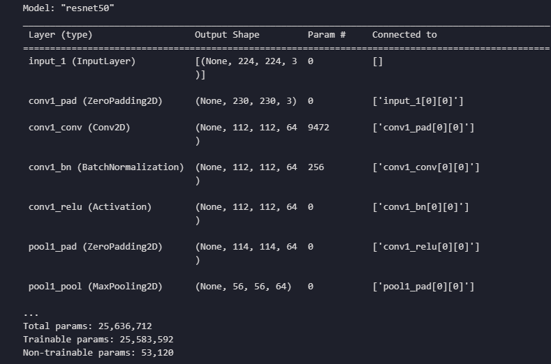
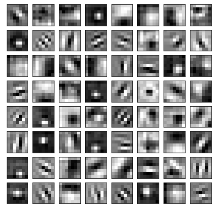
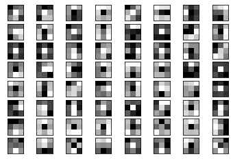
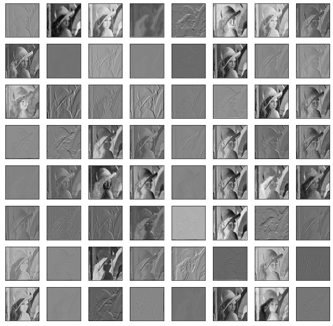

# Visualize filters of Resnet50

In this project, we have displayed the kernel values of the filters and the output of the layers

Convolution models have an abstract output in the first layers and learn features such as texture type and edges, and in the last layers they learn complex features that are close to reality.
The type of these convolutional filters are usually *LPF* and *HPF*, which have applications such as edge detection, increasing contrast, and blurring images.
The values of these filters are learned in the training process

The summary of the model is as follows:

The kernel values of this convolution layer(conv1_conv (7, 7, 3, 64)) are as follows, their size is 7x7:

and the kernel values of this convolution layer(conv2_block1_2_conv (3, 3, 64, 64)) are as follows, their size is 3*3:

We used Lena's image to display the output of the layers:

The output of this filter((1, 112, 112, 64)) is as follows:

